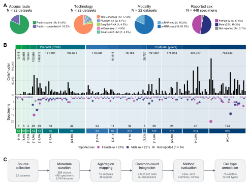

# A human brain single-cell and single-nucleus transcriptomic resource across age intervals

BrainOmicsData is the code repository for this resource.

**2,602,031 cells or nuclei · 24,659 genes · 22 source datasets · 75 clusters · 12 cell types**

Version 2 is published at ScienceDB under the existing DOI [10.57760/sciencedb.41612](https://doi.org/10.57760/sciencedb.41612). The corresponding analysis code is identified by the [v2.0.0 tag](https://github.com/mengxu98/BrainOmicsData/tree/v2.0.0). Code maintenance does not replace the public ScienceDB files.

<picture>
  <source media="(prefers-color-scheme: dark)" srcset="figures/fig1-night.svg">
  <source media="(prefers-color-scheme: light)" srcset="figures/fig1.svg">
  
</picture>

## Pipeline

The numbered drivers run from the repository root. The default analysis workflow ends at stage 11; stage 12 is a separate upload command.

| Stage | Driver | What it does |
|---|---|---|
| 01 | `01_environment.sh` | Verify the locked R 4.5.1 and Python environment |
| 02 | `02_datasets_download.sh` | Download each source dataset |
| 03 | `03_datasets_preprocessing.sh` | Reconstruct and standardize each source |
| 04 | `04_source_counts_assembly.sh` | Build cleaned count chunks, assemble the named gene panel, and accept the common matrices |
| 05 | `05_hvg_scvi_input.sh` | Select 3,000 HVGs and export the scVI input |
| 06 | `06_pca_harmony.sh` | Raw PCA, raw UMAP, Harmony |
| 07 | `07_scvi.sh` | scVI latent space |
| 08 | `08_rpca.sh` | RPCA latent space |
| 09 | `09_final_assembly.sh` | Collect completed PCA/Harmony/RPCA results, import scVI, and evaluate latent spaces |
| 10 | `10_analysis_figures.sh` | Main and supplementary figures from the prepared analysis outputs |
| 11 | `11_sciencedb_export.sh` | Build the cell-level QC and annotation inputs when absent, then export and verify a local data package |
| 12 | `12_sciencedb_upload.sh` | Transfer the sealed package |

`bash run_pipeline.sh` runs stages 01–11; `--list`, `--from`, `--to`, and `--only` select subsets. Stage 09 follows completion of all integration methods. Upload is selected explicitly with `--only 12` and is not required for reproduction.

`BRAINOMICS_EXECUTOR=local` (default) runs stages in place. Stages 01 and 05–09 also support `BRAINOMICS_EXECUTOR=slurm`; use local execution for data preparation, figures and package assembly. The Slurm wrappers wait for each job's exit status. See [`hpc/README.md`](hpc/README.md).

The numbered stages use the downloaded source datasets together with prepared
analysis inputs. Stage 04 uses cell/gene mappings and source-selection policies;
stage 10 reads the analysis metadata, statistical tables and `figures/fig2a.pdf`;
stage 11 reads the expression and annotation trees. Their locations can be set
with the environment variables listed below.

### Environment

All processing, integration, analysis and plotting use **R 4.5.1**, with package
versions recorded in `environment/r-packages.lock.tsv`. Python analyses use
**Python 3.12.8** and the versions recorded in
`environment/python-scvi-freeze.txt`.

```sh
bash environment/restore.sh
source environment/activate.sh
bash 01_environment.sh
```

The restore entry targets Linux x86_64 and requires micromamba. Its platform prerequisites are described in [`environment/REPRODUCIBILITY.md`](environment/REPRODUCIBILITY.md). By default it creates the ignored `.brainomics-env/` prefix; set `BRAINOMICS_ENV_ROOT` to use another location. A GPU run also requires a compatible NVIDIA driver.

## Layout

| Path | Contents |
|---|---|
| `functions/` | Shared helpers, figure assembly and support scripts, package exporters, normalization scripts |
| `integration/` | Integration and evaluation modules |
| `processing/`, `download/` | Per-dataset reconstruction and download scripts |
| `annotation/` | Annotation inputs and adopted-label export |
| `analysis/`, `plotting/` | Analysis summaries and figure-numbered plotting scripts |
| `sciencedb/` | Package metadata, manifest, reader and anonymization utilities |
| `results/` | Local analysis inputs used by the figure scripts (outside version control) |
| `environment/` | Package locks and restore/verification scripts |
| `hpc/` | HPC submission scripts (`hpc/*.sbatch`, site settings in `hpc/local.env`) and transfer helpers |
| `data/` | Source access table, donor crosswalks, feature metadata |
| `tests/` | Workflow tests and package contract checks |

The manuscript figure entry points are `plotting/fig1.R` through
`plotting/fig5.R` and `plotting/figS1.R` through `plotting/figS4.R`. Each writes a
matching 600 dpi or higher PNG under `figures/`. Active panel PDFs use only
their panel identifiers (`fig1a.pdf`, `fig2f.pdf`, and so on); vector copies
and source tables remain in the same directory.
Figure 5's complete 22-source extraction, aggregation, source-level sign test,
fixed-context input, and panel assembly are documented in
[`analysis/fig5_README.md`](analysis/fig5_README.md). Run
`bash analysis/fig5_rebuild.sh` where the complete 22-source inputs are available
to regenerate its source tables and final figure; stage 10 redraws from the
source tables.
`plotting/` contains only figure-numbered
R scripts; shared configuration, panel assembly and other plotting support
scripts live under `functions/`. The S1 age-interval and S2 brain-region entry
points redraw their PDFs from the 2,602,031-cell metadata and RPCA embedding
before exporting PNGs.
The S3 entry point exports PNG from its PDF and accepts `--redraw` to draw the PDF from the analysis inputs using
`functions/figS3_source.R`.
S4 shows all 33 markers in the adopted list, with all 2,602,031 cells in each
FeatureDimPlot. Its complete drawing code is in `functions/figS4_source.R`;
`plotting/figS4.R` reads the full analysis inputs and exports the numbered PDF
and 600 dpi PNG.

Local analysis inputs live under `results/`: `analysis_run/` (figure inputs), `frozen_run/` (stage-11 inputs), `annotation/`, `run_root/` (stage-04 inputs and outputs) and `work/` (stage-11 work directory). `results/`, `figures/` (except the light and dark Figure 1 SVGs) and the manuscript folders are outside version control. PNG exports remain local for manuscript preparation; GitHub displays the corresponding SVG for the reader's color theme.

Analysis modules that use the logical name `integration_25` resolve it through
`BRAINOMICS_RESULTS_DIR`. Figures and annotation use the 2,602,031-cell inputs
under `results/analysis_run/` and `results/annotation/`.

## Environment variables

| Variable | Purpose | Used by |
|---|---|---|
| `BRAINOMICS_DATA_ROOT` | Source data root; defaults to `<repository>/../../data/BrainOmicsData` | 02, 03, 11 |
| `BRAINOMICS_RESULTS_DIR` | Integration outputs; defaults to `$BRAINOMICS_RUN_ROOT/integration` | 04–09, 11 |
| `BRAINOMICS_RUN_ROOT` | Input policies and run outputs; defaults to `<repository>/results/run_root` | 04–09, 11 |
| `BRAINOMICS_FROZEN_DIR` | Frozen results used for local package assembly | 11 |
| `BRAINOMICS_ANALYSIS_DIR` | Prepared analysis and figure inputs | 10, 11 |
| `BRAINOMICS_ANALYSIS_RUN_DIR` | Directory containing `01_metadata/metadata_working.rds` | 10 |
| `BRAINOMICS_FIGURE_DATA_DIR` | Directory containing the figure summary tables | 10 |
| `BRAINOMICS_REFERENCE_SUMMARY` | Figure 1 resource-summary directory | 10 |
| `BRAINOMICS_FIG2_METADATA_FILE` | Cell and cluster table used by Figure 2A | 10 |
| `BRAINOMICS_RPCA_UMAP_FILE` | RPCA UMAP coordinates used by Figures 2 and S1–S3 | 10 |
| `BRAINOMICS_METADATA_FILE` | Cell-level analysis metadata | 11 and standalone analyses |
| `BRAINOMICS_ANNOTATION_TABLE` | Adopted 75-cluster annotation used by analyses and figures | 10 |
| `BRAINOMICS_CLUSTER_ANNOTATION` | Versioned cluster annotation used for the cell-level package table | 11 |
| `BRAINOMICS_SOURCE_LABEL_FILE` | Harmonized source-label table used for cLISI | standalone LISI analysis |
| `BRAINOMICS_MARKER_COUNTS_DIR` | Full-cell marker-count inputs for Figure S4 | 10 |
| `BRAINOMICS_MARKER_ORDER_FILE` | Ordered marker list for Figure S4 | 10 |
| `BRAINOMICS_MARKER_EVIDENCE_FILE` | Cluster-level expression reference for Figure S4 | 10 |
| `BRAINOMICS_FULL_LISI_DIR` | Per-cell cLISI result directory used during package assembly | 11 |
| `BRAINOMICS_CLUSTER_ASSIGNMENTS` | Cluster assignments used when assembling cell-level QC | 11 |
| `BRAINOMICS_FIG5_PANEL_DIR` | Per-source Figure 5 extraction tables | standalone Figure 5 rebuild |
| `BRAINOMICS_FIG5_FIXED_DIR` | S15 prefrontal-cortex donor tables for Figure 5C | standalone Figure 5 rebuild |
| `BRAINOMICS_FIG5_SOURCE_DIR` | Figure 5 plotting tables | 10 |
| `BRAINOMICS_FIG5_OUTPUT_DIR` | Figure 5 panel and assembled figures | 10 |
| `BRAINOMICS_PACKAGE_DIR` | Local package output; defaults to `$BRAINOMICS_RUN_ROOT/package` | 11 |
| `BRAINOMICS_WORK_DIR` | Export work directory (cell-level QC and annotation tables) | 11 |
| `BRAINOMICS_LISI_DIR` | Per-cell iLISI checkpoints | 11 |

Stage 11 writes a local package. The published ScienceDB files are not changed by stages 01–11.

## Checks

```sh
bash tests/test_workflow.sh
BRAINOMICS_FULL_TESTS=1 bash tests/test_workflow.sh
python3 tests/test_package_contract.py
```

The default workflow check covers syntax, data/script consistency, interfaces,
and the available local package contract. `BRAINOMICS_FULL_TESTS=1` also runs
small synthetic tests of age mapping, LISI method identity, R/Python export and
readback, and PCA/RPCA/Harmony, neighbor and clustering algorithms. These tests
require the configured environment and exercise small datasets; they do not
rerun the full atlas or train scVI. Environment installation and verification
are separate from executing these tests. See
[Software checks](environment/REPRODUCIBILITY.md#software-checks) for details.

## Deposit package

The deposit package is stored outside the repository.
It holds 84 files (82 payload, about 22 GB): `expression/`, `embeddings/`, `validation/`, `metadata/`, `provenance/`, `scripts/`, `README.md`, `md5sum.txt`.

## Licence

MIT (see `LICENSE`).
